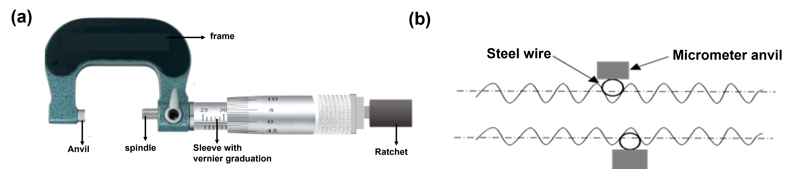
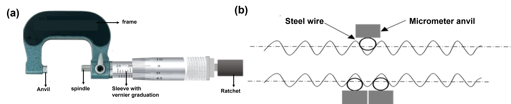
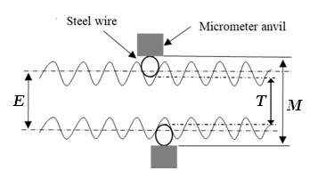
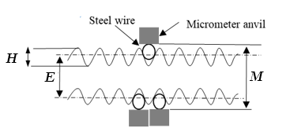

## Theory

Screw threads are commonly used in mechanical assemblies to verify their compliance with manufacturing specifications and tolerances. Accurate measurement of their key parameters, including major diameter, is crucial for ensuring proper functioning.

**Two-wire method:**

The two-wire method utilizes two wires of equal diameter placed tangentially on opposite flanks of the screw thread. The distance between the wires is measured using a micrometer. The wire diameter, pitch of the thread, and the effective diameter (E) can be calculated. Fig. 1 below represents the schematic of the micrometer and the two-wire technique.

<b>Fig. 1. (a) Schematic of Micrometer (b) Two-wire technique</b>

**Three-wire Method:**

The three-wire method is a more accurate and less sensitive technique for metric thread than the two-wire method for the measurement of screw thread parameters. This method involves placing three wires of known diameter in contact with the screw thread flanks and measured using micrometer. The flank is the slanted surface between the peak of the thread and the root. Fig. 2 below represents the schematic of the micrometer and the three-wire technique.

<b>Fig.2. (a) Schematic of Micrometer (b) Three-wire technique</b>>

**Calculation:**

Metric thread is used in this experiment having thread angle (&alpha;) = 60 &deg;

<b>(i)	Two-wire method:</b>

<b>Fig. 3 Two-wire measurement</b> 

M = distance over the wire, measured using a suitable micrometer.

Effective diameter (E), 

$$E  = T + P \tag{1}$$

Where T is the dimension under the wire till the point of contact between wire and screw flank, and P is the correction factor

And, 

$$T = M - 2d \tag{2}$$

d = diameter of the wire

$$P = \frac{p}{2} cot (\frac{\alpha}{2}) – d [cosec (\frac{\alpha}{2}) - 1] \tag{3}$$ 

p = pitch of the thread

&alpha; = thread angle = 60 &deg; (for metric thread)

<b>(ii) Three-wire method:</b>

<b>Fig. 4 Three-wire measurement</b>

M = distance over the wire, measured using a suitable micrometer.

p = pitch of the thread screw

Height of threads (H),

$$H = \frac{p}{2} cot (\frac{\alpha}{2}) \tag{4}$$

&alpha; = angle of thread = 60 &deg; (for metric thread)  

$$E = M – d [1 + cosec (\frac{\alpha}{2}) + \frac{p}{2} cot (\frac{\alpha}{2})] \tag{5}$$  

								