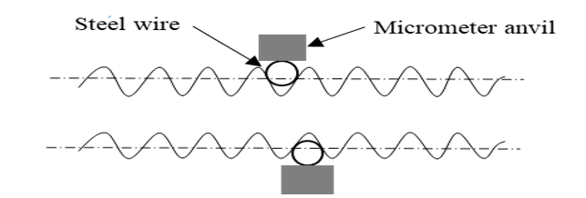
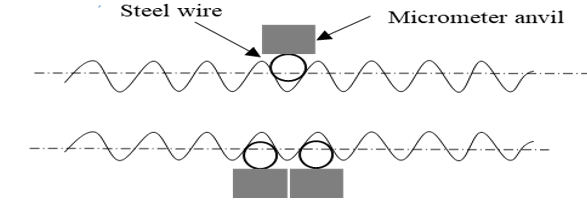

## Theory

Screw threads are commonly used in mechanical assemblies to provide secure connections and transmit force. Accurate measurement of their key parameters, including major diameter, is crucial for ensuring proper functioning and transmission of load.

**Two-wire method:**

The two-wire method utilizes two wires of equal diameter placed tangentially on opposite flanks of the screw thread. The distance between the wires is measured using a micrometer. The wire diameter, pitch of the thread, and the effective diameter (E) can be calculated. Figure 1 below represents the two-wire technique.

Fig. 1 Two wire technique

**Three-wire Method:**

The three-wire method is a more accurate technique than the two-wire method for the measurement of screw thread parameters. This method involves placing three wires of known diameter in contact with the screw thread flanks, forming an equilateral triangle. Figure 2 below represents the three-wire technique.

Fig. 2  Three-wire technique

**Calculation:**

Metric thread is used in this experiment having thread angle ( &alpha; ) = 60 &deg;

<b>(i)	Two-wire method:</b>

Fig. 3 Two-wire measurement 

M = distance over the wire, measured using a suitable micrometer.

Effective diameter ( E ) = T + P

Where T is the dimension under the wire, and P is the correction factor.

And, T = M - 2d

d = diameter of the wire

P = p/2 cot ( &alpha;/2 ) – d [ cosec ( &alpha;/2 ) - 1 ] 

p = pitch of the thread

&alpha; = thread angle = 60 &deg; ( for metric thread )

<!-- for p = 1.25 mm, d = 0.722 mm, M = 25.08 mm -->

E = T + P

T = M – 2d

P = p/2 cot ( &alpha;/2 ) – d [ cosec ( &alpha;/2 ) - 1 ]
<!-- Therefore, P = 0.3605 mm
T = 23.636 mm
E = 23.9965 mm -->

<b>(ii) Three-wire method:</b>

Fig. 4 Three-wire measurement

M = distance over the wire, measured using a suitable micrometer.

p = pitch of the thread screw

Height of threads ( H ) = p/2 cot ( &alpha;/2 )

&alpha; = angle of thread = 60 &deg; ( for metric thread )  

E = M – d [ 1 + cosec ( &alpha;/2 ) ] + p/2 cot ( &alpha;/2 )  

<!-- For, p = 1.25 mm, d = 0.722 mm, M = 25.088 mm 
 H = p/2 cot (α/2) = 1.0825 mm
E = M – d [1+cosec (α/2)] + p/2 cot (α/2) = 21.7515 mm-->
 

								