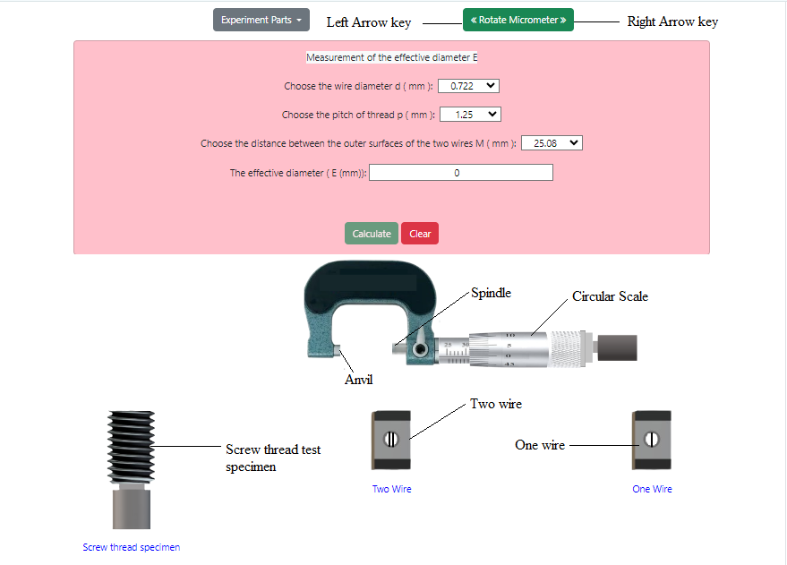

## Procedure

<!-- 

  
Figure 1. Gear tooth vernier caliper with spur gear          

 -->

1. First click on 'Two-wire' under 'Experiment Parts'. Select 0.722 mm as the value of wire diameter d from the
given dropdown. The value of pitch of thread p is 1.25 mm.

  
Figure 1. Measurement of Screw Threads Parameters Simulation model          

     

2. Click on the one wire for two times to place the two wires on the measuring faces of micrometer spindle and anvil.

3. Click on the screw thread specimen to place it in between the two wires on the measuring faces of micrometer spindle and anvil. Click on the left side arrow key on the 'Rotate Micrometer' button. Wait until the circular scale of the micrometer stops rotating. Again click on the same arrow key. Click it until the screw thread is properly fixed between the wires. After a ratchet wrench sound one alert message will be shown when it is properly fixed. 

4. Click on 'Calculate' button to find out the value of the effective diameter ( E (mm)) and 
the distance between the outer surfaces of the two wires M ( mm ). Click on the right side arrow key on the 'Rotate Micrometer' button two to three times to move the micrometer spindle from fixed position.

5. Click on the screw thread specimen to place it back to its previous position. Click on 'Clear' button.
Follow steps 2-4 by selecting 0.866 mm as the value of wire diameter d from the given dropdown.
The value of pitch of thread p is 1.5 mm. Click on 'Clear' button.

6. Now click on 'Three-wire' under 'Experiment Parts'. Select 0.722 mm as the value of wire diameter d from the given dropdown. The value of pitch of thread p is 1.25 mm.

7. Click on the one wire and two wire to place them on the measuring faces of micrometer spindle and anvil.

8. Follow steps 3-4 to measure the effective diameter ( E (mm)), the distance between the outer surfaces of the two wires M ( mm ) and the value of H ( height of the threads in mm ). 

9. Click on the screw thread specimen to place it back to its previous position. Click on 'Clear' button.
Follow steps 7-9 by selecting 0.866 mm as the value of wire diameter d from the
given dropdown. The value of pitch of thread p is 1.5 mm. Click on 'Clear' button.
